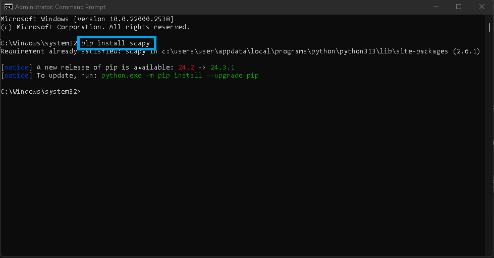
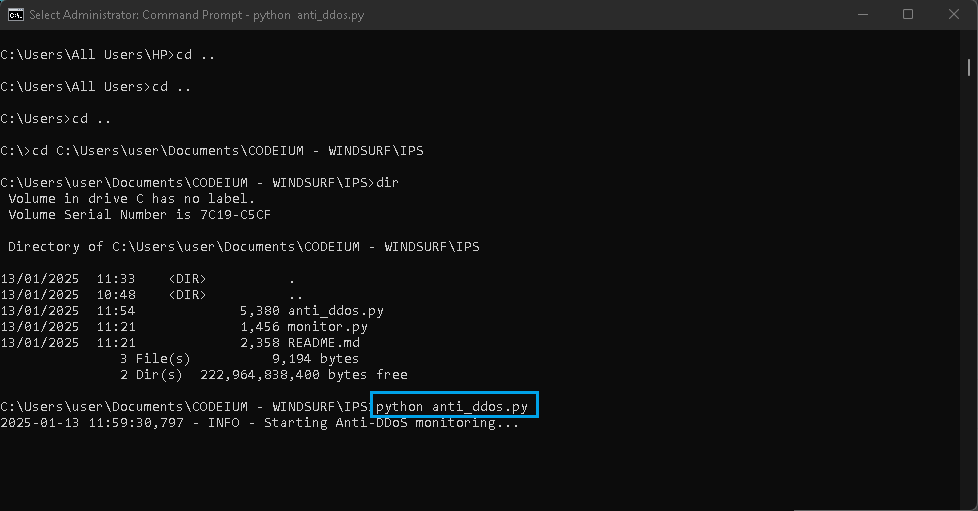
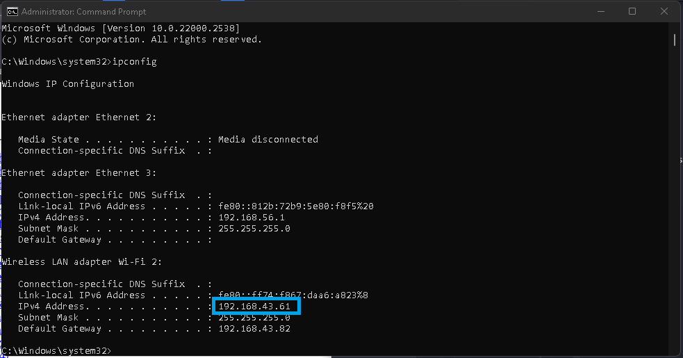
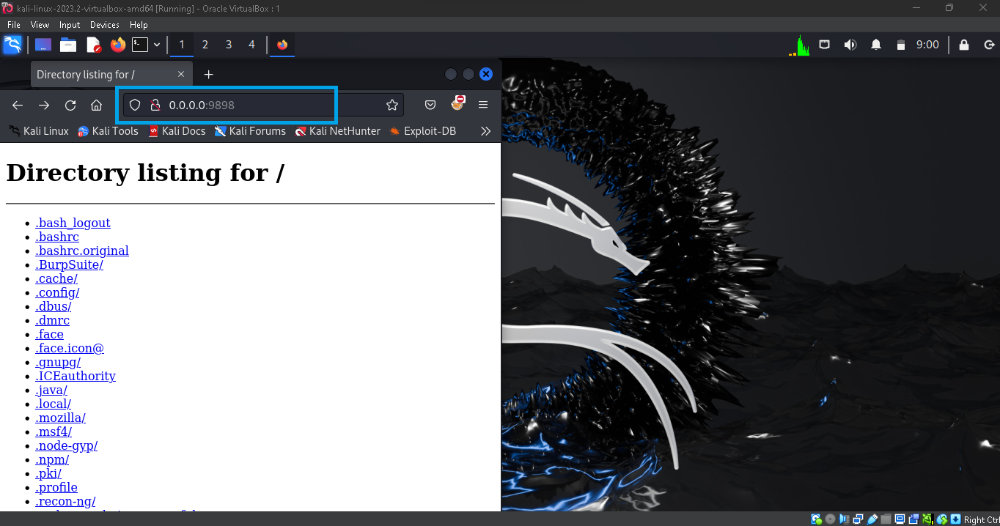
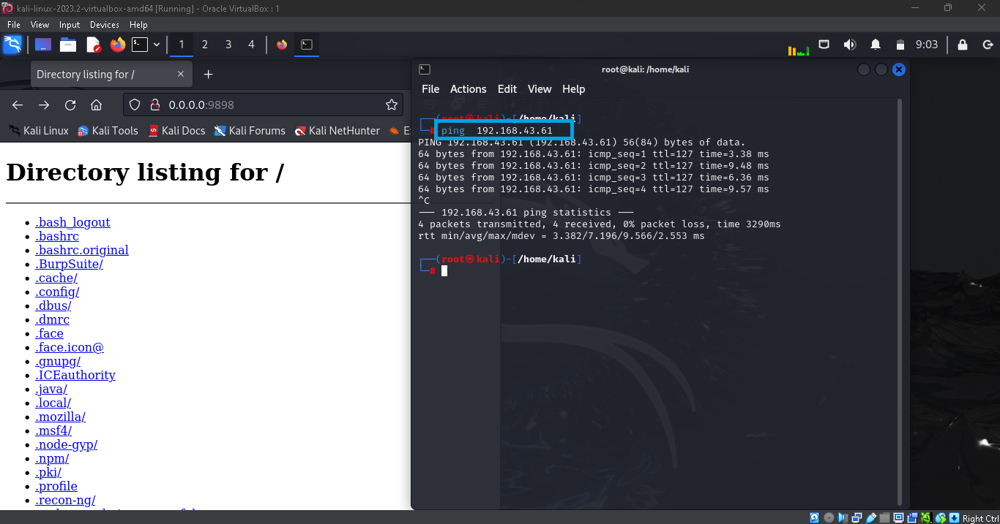
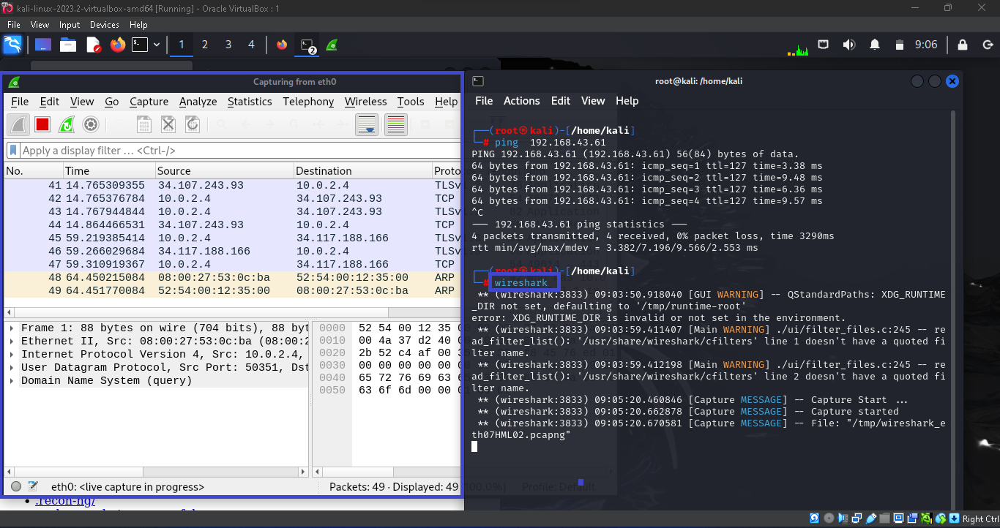
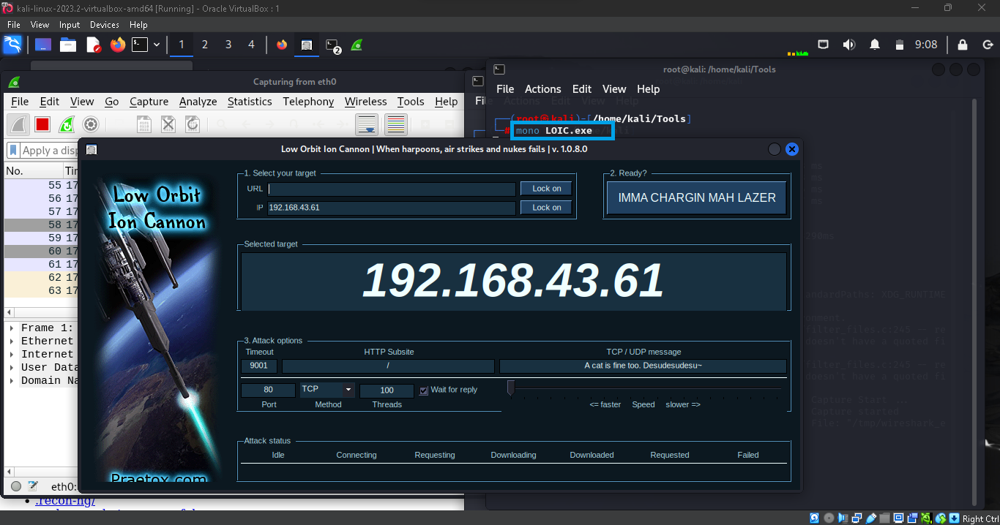
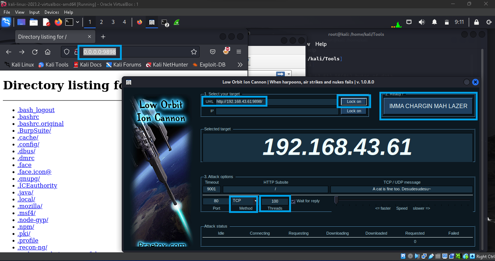
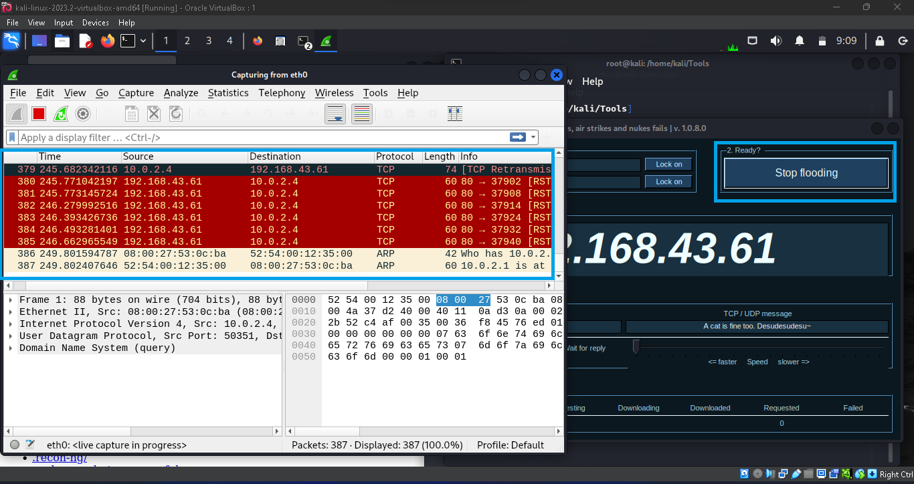
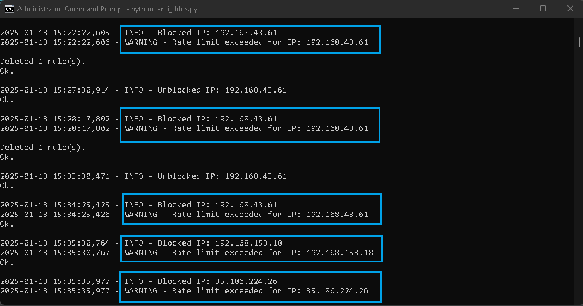

# Using the Tool

## Fig 1.0 – Installing Scapy

---

## Fig 2.0 - Starting the Anti-DDoS Tool

---

## Testing the Tool

### Fig 1.0: Starting an HTTP Web Server

---

### Fig 2.0: Confirming the Network IP Address of the Target System

---

### Fig 3.0: Loading the Web Server on Your Pentest Machine

---

### Fig 4.0: Pinging the Target IP to Confirm Connection

---

### Fig 5.0: Launching Wireshark

---

### Fig 6.0: Launching LOIC Tool for a DDoS Attack

The Low Orbit Ion Cannon (LOIC) is a user-friendly tool that launches DoS and DDoS attacks.

---

### Fig 7.0: Setting Up the LOIC Tool

1. Copy the web application URL.
2. Replace `0.0.0.0` with the IP of the target server (as obtained in Fig 2.0).
3. Set the method of the flood to a TCP request.
4. Set the Threads (Amount of Request) to 100.
5. Click on **IMMA CHARGIN MAH LAZER** to start the flood.

---

### Fig 8.0: Monitoring the Flood with Wireshark

The flooding starts, but it is dropped by the anti-DDoS tool. This can be observed in Wireshark. Use the "Stop flooding" button to stop the attack.

---

### Fig 9.0: Results from the Anti-DDoS Tool

*The results displayed by the tool during this kind of attack.*
